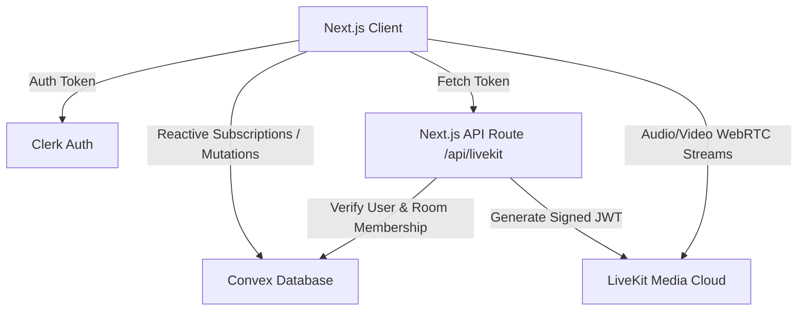

# Real-Time Chat & Call Platform

A premium, full-featured real-time chat and collaboration platform that supports direct messaging, group chat rooms, media attachments, and fully integrated **Audio & Video Calling** powered by LiveKit and Convex.

---

## 🚀 Key Features

*   **Real-time Messaging**: Instant message delivery and sync with active read receipts and seen indicators.
*   **Audio & Video Calling**: Seamless calling integration within chat headers, supporting individual and group rooms.
*   **Global Call Handling**: Background call listener with a custom ringing tone synthesized using Web Audio API and real-time accept/decline popup alerts.
*   **Media & Attachments**: File, video, and image upload capabilities powered by UploadThing.
*   **Contacts & Relationships**: Friendship requests, friends list management, and real-time status indicators.
*   **Secure Authentication**: Secure, JWT-verified logins and user profile synchronization using Clerk.

---

## 🛠️ Tech Stack

*   **Framework**: [Next.js (App Router)](https://nextjs.org/)
*   **Backend & DB**: [Convex](https://convex.dev/) (Fully reactive database and serverless functions)
*   **Media Server**: [LiveKit](https://livekit.io/) (Real-time voice and video track streaming)
*   **Authentication**: [Clerk](https://clerk.com/) (Identity provider)
*   **Styling**: [Tailwind CSS v4](https://tailwindcss.com/) & [Shadcn UI](https://ui.shadcn.com/)
*   **File Storage**: [UploadThing](https://uploadthing.com/)

---

## 📐 System Architecture

The application is built on a serverless, reactive architecture where state synchronizes instantly across all clients without manual WebSockets management.



### Call Lifecycle Flow
1.  **Initiation**: A user clicks the call button (📞/🎥), triggering the `startCall` mutation on Convex to set the conversation's active call state.
2.  **Notification**: Convex pushes this state change to all conversation members. A global provider detects the call, plays a ringtone, and shows the incoming call banner.
3.  **Token Exchange**: The accepting user requests a token via `/api/livekit`. The Next.js API route validates the user's identity through Clerk, verifies conversation membership via the Convex HTTP Client, and issues a signed LiveKit Token.
4.  **Connection**: The client connects to the LiveKit Room using the token, enabling WebRTC media streams.
5.  **Termination**: When all participants hang up (or the initiator cancels), the `leaveCall` mutation logs the call duration in `callHistory` and clears the conversation state.

---

## ⚙️ Environment Variables Setup

Create a `.env.local` file in the root directory and add the following keys:

```env
# Convex Deployment
CONVEX_DEPLOYMENT=your_convex_deployment_id
NEXT_PUBLIC_CONVEX_URL=https://your_project.convex.cloud
NEXT_PUBLIC_CONVEX_SITE_URL=https://your_project.convex.site

# Clerk Authentication
NEXT_PUBLIC_CLERK_PUBLISHABLE_KEY=pk_test_...
CLERK_SECRET_KEY=sk_test_...
CLERK_WEBHOOK_SECRET=whsec_...

# UploadThing configuration
UPLOADTHING_TOKEN=your_uploadthing_token

# LiveKit Configurations
LIVEKIT_API_KEY=your_livekit_api_key
LIVEKIT_API_SECRET=your_livekit_api_secret
NEXT_PUBLIC_LIVEKIT_URL=wss://your_project.livekit.cloud
```

---

## 🏃 Getting Started

### 1. Install Dependencies
```bash
npm install
```

### 2. Start Convex Dev Sync
Convex needs to run its code generation and function deployment sync in the background:
```bash
npx convex dev
```

### 3. Start Next.js Development Server
```bash
npm run dev
```

Open [http://localhost:3000](http://localhost:3000) with your browser to experience the chat and calling app!
