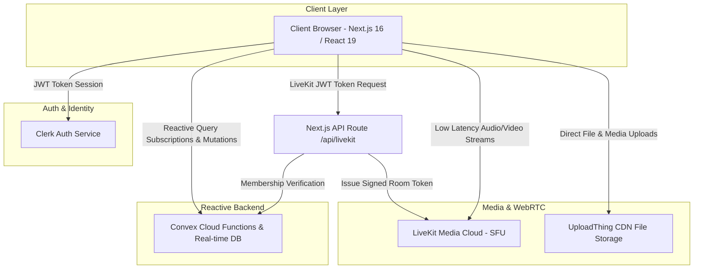
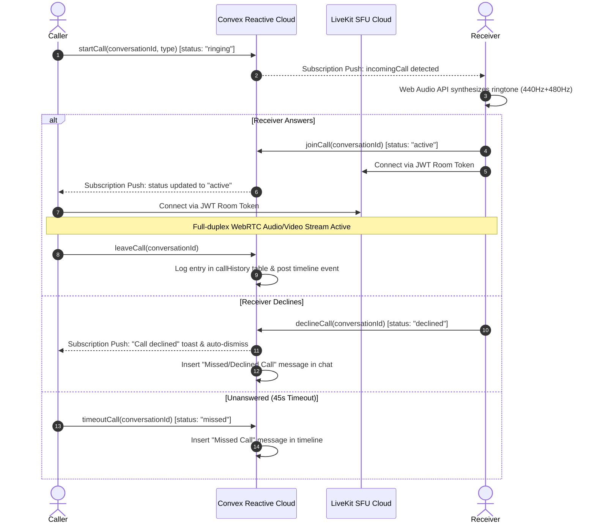

# 🌐 ChatSphere — Real-Time Communication Platform

ChatSphere is a modern, real-time communication platform combining instant messaging, media collaboration, online presence, and HD audio/video calling powered by **Next.js 16 (App Router + Turbopack)**, **React 19**, **Convex Reactive Backend**, **LiveKit WebRTC Cloud**, **Clerk Authentication**, and **UploadThing**.

---

## 📑 Table of Contents

- [Overview & Highlights](#-overview--highlights)
- [System Architecture](#-system-architecture)
- [Key Features](#-key-features)
  - [1. Real-Time Messaging & Cursor Pagination](#1-real-time-messaging--cursor-pagination)
  - [2. Multi-User Ephemeral Typing Indicators](#2-multi-user-ephemeral-typing-indicators)
  - [3. Online Presence & Heartbeat Engine](#3-online-presence--heartbeat-engine)
  - [4. Server-Synchronized WebRTC Call State Machine](#4-server-synchronized-webrtc-call-state-machine)
  - [5. Interactive Message Actions & Reactions](#5-interactive-message-actions--reactions)
  - [6. Rich Media & Attachment Pipeline](#6-rich-media--attachment-pipeline)
  - [7. Social Graph & Group Management](#7-social-graph--group-management)
  - [8. User Profile Customization](#8-user-profile-customization)
- [Technology Stack](#-technology-stack)
- [Convex Database Schema](#-convex-database-schema)
- [Project Directory Structure](#-project-directory-structure)
- [Environment Variables Configuration](#-environment-variables-configuration)
- [Getting Started & Local Development](#-getting-started--local-development)
- [Verification & Quality Assurance](#-verification--quality-assurance)
- [License](#-license)

---

## 🌟 Overview & Highlights

ChatSphere is designed from the ground up for high concurrency, low latency, and zero WebSocket boilerplate. By leveraging Convex's reactive database engine, state changes in conversations, typing indicators, presence, and calls reflect across connected clients in sub-50 milliseconds.


```mermaid
graph TD
    subgraph Client Layer
        Browser[Client Browser - Next.js 16 / React 19]
    end

    subgraph Auth & Identity
        Clerk[Clerk Auth Service]
    end

    subgraph Reactive Backend
        Convex[Convex Cloud Functions & Real-time DB]
    end

    subgraph Media & WebRTC
        LiveKit[LiveKit Media Cloud - SFU]
        UploadThing[UploadThing CDN File Storage]
    end

    Browser -->|JWT Token Session| Clerk
    Browser -->|Reactive Query Subscriptions & Mutations| Convex
    Browser -->|LiveKit JWT Token Request| NextAPI[Next.js API Route /api/livekit]
    NextAPI -->|Membership Verification| Convex
    NextAPI -->|Issue Signed Room Token| LiveKit
    Browser -->|Low Latency Audio/Video Streams| LiveKit
    Browser -->|Direct File & Media Uploads| UploadThing
```

---

## 📐 System Architecture

### WebRTC Call Lifecycle State Machine

ChatSphere implements a server-synchronized call state machine that ensures both callers and receivers maintain atomic states across page refreshes, tab closures, and network interruptions.


```mermaid
sequenceDiagram
    autonumber
    actor Caller as Caller
    participant Convex as Convex Reactive Cloud
    participant LiveKit as LiveKit SFU Cloud
    actor Receiver as Receiver

    Caller->>Convex: startCall(conversationId, type) [status: "ringing"]
    Convex-->>Receiver: Subscription Push: incomingCall detected
    Receiver->>Receiver: Web Audio API synthesizes ringtone (440Hz+480Hz)
    
    alt Receiver Answers
        Receiver->>Convex: joinCall(conversationId) [status: "active"]
        Receiver->>LiveKit: Connect via JWT Room Token
        Convex-->>Caller: Subscription Push: status updated to "active"
        Caller->>LiveKit: Connect via JWT Room Token
        Note over Caller,Receiver: Full-duplex WebRTC Audio/Video Stream Active
        Caller->>Convex: leaveCall(conversationId)
        Convex->>Convex: Log entry in callHistory table & post timeline event
    else Receiver Declines
        Receiver->>Convex: declineCall(conversationId) [status: "declined"]
        Convex-->>Caller: Subscription Push: "Call declined" toast & auto-dismiss
        Convex->>Convex: Insert "Missed/Declined Call" message in chat
    else Unanswered (45s Timeout)
        Caller->>Convex: timeoutCall(conversationId) [status: "missed"]
        Convex->>Convex: Insert "Missed Call" message in timeline
    end
```

---

## ✨ Key Features

### 1. Real-Time Messaging & Cursor Pagination
- **Cursor-Based Infinite Scroll**: Uses Convex's native `.paginate(args.paginationOpts)` on the indexed `By_conversationId` key. Loads 35 messages initially and seamlessly pulls batches of 20 as the user scrolls up.
- **Scroll Anchoring Delta Retention**: Preserves precise scroll position when older messages load at the top using `scrollTop = element.scrollHeight - prevScrollHeight + prevScrollTop`, eliminating layout jumps.
- **Automatic Smart Stick-to-Bottom**: Automatically follows incoming messages if the user is already near the bottom (<120px), while remaining in place if the user is reading historical transcripts.
- **Read Receipts & Seen Indicators**: Displays single tick (`✓ Sent`) or double ticks (`✓✓ Read`) in direct chats, and detailed `Read by N` receipts in group chats.

### 2. Multi-User Ephemeral Typing Indicators
- **High-Performance Typing State**: Backed by a dedicated `typing` table with a 3-second TTL (`conversationId`, `userId`, `expiresAt`).
- **Keystroke Throttling & Debounce**: Typing heartbeat mutations are throttled to a maximum of 1 per 1.5 seconds, with a 1.8-second inactivity debounce timer.
- **Natural Language Formatting**: Dynamic formatting handles multiple concurrent typists gracefully:
  - 1 user: *"Alex is typing..."*
  - 2 users: *"Alex and Sarah are typing..."*
  - 3+ users: *"Alex, Sarah, and 2 others are typing..."*

### 3. Online Presence & Heartbeat Engine
- **Active Heartbeat Tracker**: `usePresence` hook runs a 25-second heartbeat cycle that sets `isOnline: true` and updates `lastSeenAt: Date.now()`.
- **Window Visibility Aware**: Listens to browser `visibilitychange` and `beforeunload` events to instantly transition users to offline when tabs are minimized or closed.
- **Relative Status Badges**: Visual indicator with pulsating green dot for online users or humanized relative time (*"Last seen 5m ago"*, *"Last seen yesterday"*).

### 4. Server-Synchronized WebRTC Call State Machine
- **Integrated HD Voice & Video**: Direct 1-on-1 and multi-participant group calling powered by LiveKit SFU.
- **Web Audio Ringtone Generator**: Synthesizes realistic dual-tone multifrequency (440Hz & 480Hz) ringback audio directly in the browser with zero external MP3 dependencies.
- **Server Decline & Unanswered Timeout**: Real-time decline synchronization across tabs, with automatic 45-second timeouts converting unanswered calls into missed call logs.
- **Conversation Timeline Integration**: Call events are automatically logged into the chat stream (`📞 Missed voice call`, `📹 Video call ended - 14m`).

### 5. Interactive Message Actions & Reactions
- **Quick Hover Toolbar & Mobile Drawer**: Hovering on desktop or long-pressing on touch devices brings up message actions.
- **Emoji Reactions**: Interactive emoji picker with reactive counts and visual highlighting for emojis toggled by the current user.
- **Quoted Replies**: One-click reply attaches a quote preview block to the composer with instant jump-to-context capability.
- **Sender Message Editing**: Edit message text inline with an automatic `(edited)` timestamp marker.
- **Message Deletion**: Safe soft-deletion with user confirmation dialogs and permission controls.

### 6. Rich Media & Attachment Pipeline
- **UploadThing Integration**: Drag-and-drop or popover file upload supporting images, videos, audio, and documents.
- **Strict Server Validation**: Enforces MIME types (JPEG, PNG, WEBP, GIF, MP4, WEBM, PDF, DOCX, ZIP, TXT) and 16MB file limits.
- **In-Chat Previewers**: Integrated image lightboxes, inline HTML5 video players, and stylized file download cards displaying formatted file sizes.

### 7. Social Graph & Group Management
- **Friend Request Workflow**: Search users by username or email, send friend requests, accept or decline with real-time badge updates.
- **Group Conversations**: Create multi-user channels, appoint group owners, manage group rosters, and safely leave or disband groups.

### 8. User Profile Customization
- **Custom Avatars & Badges**: Users can customize their display name, status quote, bio, and upload custom avatars that take priority over Clerk default profile images.
- **User Profile Modal**: Click any member's avatar to view their detailed bio, custom status, and direct contact options.

---

## 🛠️ Technology Stack

| Layer | Technologies |
| :--- | :--- |
| **Frontend Framework** | [Next.js 16.2](https://nextjs.org/) (App Router, Turbopack, React 19) |
| **Reactive Backend** | [Convex 1.42+](https://convex.dev/) (Serverless ACID database & real-time subscriptions) |
| **WebRTC Media Cloud** | [LiveKit Cloud](https://livekit.io/) (`livekit-server-sdk`, `@livekit/components-react`) |
| **Authentication** | [Clerk](https://clerk.com/) (`@clerk/nextjs`, `convex/react-clerk`) |
| **File Storage** | [UploadThing](https://uploadthing.com/) (`@uploadthing/react`, `uploadthing`) |
| **Styling & UI** | [Tailwind CSS v4](https://tailwindcss.com/), [Radix UI](https://www.radix-ui.com/), [Lucide Icons](https://lucide.dev/) |
| **Animation & Feedback** | [Motion (Framer Motion)](https://motion.dev/), [Sonner Toast](https://sonner.emilkowal.ski/) |

---

## 🗄️ Convex Database Schema

Below is the complete database structure defined in [`convex/schema.ts`](file:///c:/Users/prith/Desktop/My%20Projects/Personal/ChatApp/my-app/convex/schema.ts):

| Table | Description | Primary Indexes |
| :--- | :--- | :--- |
| `users` | User identity, Clerk mapping, custom profile fields, and presence state | `By_email`, `By_clerkId` |
| `conversations` | 1-on-1 chats and group channels, active call state | `By_groupId` |
| `conversationMembers` | Conversation participant mapping and read receipt tracking | `By_memberId`, `By_conversationId`, `By_memberId_conversationId` |
| `messages` | Chat messages supporting text, typed attachments, replies, reactions, and call events | `By_conversationId`, `By_senderId`, `By_conversationId_senderId`, `By_conversationId_type` |
| `typing` | Ephemeral typing indicator records with TTL expiry timestamps | `By_conversationId`, `By_conversationId_userId` |
| `friends` | Bidirectional friendships between users | `By_user1`, `By_user2`, `By_user1_and_user2`, `By_conversationId` |
| `requests` | Inbound and outbound friend invitations | `By_senderId`, `By_receiverId`, `By_senderId_and_receiverId` |
| `groups` | Multi-user group metadata, title, and ownership | `By_ownerId` |
| `groupMembers` | Group membership mapping with `OWNER` / `MEMBER` roles | `By_groupId`, `By_userId`, `By_groupId_userId` |
| `callHistory` | Complete audit log of all completed, declined, and missed calls | `By_conversationId` |

---

## 📂 Project Directory Structure

```text
my-app/
├── app/
│   ├── (marketing)/                # Landing page & authentication routes
│   │   ├── page.tsx                # High-conversion interactive landing page
│   │   ├── sign-in/                # Clerk Sign-In route
│   │   └── sign-up/                # Clerk Sign-Up route
│   ├── (root)/                     # Core authenticated application
│   │   ├── conversations/          # Conversation views & chat rooms
│   │   │   ├── [conversationId]/   # Active conversation room page
│   │   │   └── page.tsx            # Desktop conversation fallback
│   │   ├── friends/                # Friend requests & contact manager
│   │   ├── profile/                # User profile customization settings
│   │   ├── error.tsx               # Global application error boundary
│   │   ├── loading.tsx             # Route-level suspense loading skeleton
│   │   └── layout.tsx              # Authenticated root layout (CallProvider & StoreUser)
│   ├── api/
│   │   ├── livekit/route.ts        # LiveKit WebRTC room token generation endpoint
│   │   └── uploadthing/            # UploadThing file upload router & core logic
│   └── layout.tsx                  # Global HTML wrapper (Theme, Clerk & Convex providers)
├── components/
│   ├── auth/                       # Authentication dialogs and Clerk appearance themes
│   ├── shared/
│   │   ├── CallProvider.tsx        # Global WebRTC call state machine & audio synthesizer
│   │   ├── StoreUserEffect.tsx     # Identity sync & presence heartbeat runner
│   │   ├── Conversation/           # Chat interface components
│   │   │   ├── ActiveConversation.tsx  # Main chat view and message composer
│   │   │   ├── MessageList.tsx         # Paginated message list with scroll anchoring
│   │   │   ├── MessageItem.tsx         # Message bubbles, reactions & attachments
│   │   │   ├── MessageActions.tsx      # Desktop context menu & mobile action drawer
│   │   │   ├── TypingIndicator.tsx     # Animated multi-user typing indicator
│   │   │   ├── PresenceIndicator.tsx   # Real-time online/offline status dot
│   │   │   ├── CallScreen.tsx          # LiveKit full-screen audio/video interface
│   │   │   ├── ConversationList.tsx    # Sidebar conversation list with active previews
│   │   │   └── AttachmentPopover.tsx   # UploadThing file attachment menu
│   │   └── profile/                # User profile view dialogs
│   └── ui/                         # Reusable Radix UI & styled Tailwind components
├── convex/                         # Convex Reactive Backend
│   ├── schema.ts                   # Strongly-typed database schema definition
│   ├── conversations.ts            # Conversation CRUD & call lifecycle mutations
│   ├── messages.ts                 # Cursor-based pagination, reactions, edit & delete
│   ├── presence.ts                 # Heartbeat, setOffline & batch presence queries
│   ├── typing.ts                   # Ephemeral typing state mutations & queries
│   ├── user.ts                     # User profile management & Clerk sync
│   └── _utils.ts                   # Auth helpers & Convex query utilities
├── hooks/                          # Custom React Hooks
│   ├── usePresence.ts              # 25-second heartbeat & visibility change manager
│   ├── useTyping.ts                # Keystroke throttling & debounced typing state
│   ├── useNavigation.tsx           # Sidebar navigation routing hook
│   └── useConversation.tsx         # URL parameter conversation detector
└── Providers/
    └── ConvexClientprovider.tsx    # Clerk + Convex integrated provider wrapper
```

---

## 🔑 Environment Variables Configuration

Create a `.env.local` file in the root directory:

```env
# ==========================================
# CONVEX BACKEND CONFIGURATION
# ==========================================
CONVEX_DEPLOYMENT=dev:your-deployment-name
NEXT_PUBLIC_CONVEX_URL=https://your-deployment.convex.cloud
NEXT_PUBLIC_CONVEX_SITE_URL=https://your-deployment.convex.site

# ==========================================
# CLERK AUTHENTICATION CONFIGURATION
# ==========================================
NEXT_PUBLIC_CLERK_PUBLISHABLE_KEY=pk_test_...
CLERK_SECRET_KEY=sk_test_...
CLERK_WEBHOOK_SECRET=whsec_...
NEXT_PUBLIC_CLERK_SIGN_IN_URL=/sign-in
NEXT_PUBLIC_CLERK_SIGN_UP_URL=/sign-up
NEXT_PUBLIC_CLERK_AFTER_SIGN_IN_URL=/conversations
NEXT_PUBLIC_CLERK_AFTER_SIGN_UP_URL=/conversations

# ==========================================
# UPLOADTHING STORAGE CONFIGURATION
# ==========================================
UPLOADTHING_TOKEN=your_uploadthing_token_here

# ==========================================
# LIVEKIT WEBRTC CLOUD CONFIGURATION
# ==========================================
LIVEKIT_API_KEY=your_livekit_api_key
LIVEKIT_API_SECRET=your_livekit_api_secret
NEXT_PUBLIC_LIVEKIT_URL=wss://your-project.livekit.cloud
```

---

## 🚀 Getting Started & Local Development

### Prerequisites

- **Node.js**: v18.18.0 or higher (v20+ recommended)
- **npm** or **pnpm** installed
- Free accounts on:
  - [Convex](https://convex.dev/)
  - [Clerk](https://clerk.com/)
  - [UploadThing](https://uploadthing.com/)
  - [LiveKit Cloud](https://livekit.io/)

### Installation Steps

1. **Clone the repository**:
   ```bash
   git clone https://github.com/PrithviKiran791/Real_time_chat_app.git
   cd Real_time_chat_app/my-app
   ```

2. **Install project dependencies**:
   ```bash
   npm install
   ```

3. **Initialize Convex**:
   ```bash
   npx convex dev
   ```
   *This command logs you into Convex, connects to your cloud project, and watches for function/schema changes.*

4. **Run the Next.js development server**:
   ```bash
   npm run dev
   ```

5. **Open the Application**:
   Navigate to [http://localhost:3000](http://localhost:3000) in your browser.

---

## 🧪 Verification & Quality Assurance

To ensure production readiness, run the following automated checks:

```bash
# 1. Type-check with TypeScript compiler
npx tsc --noEmit

# 2. Lint codebase with ESLint
npm run lint

# 3. Create an optimized production build
npm run build
```

---

## 📄 License

This project is licensed under the [MIT License](LICENSE).
